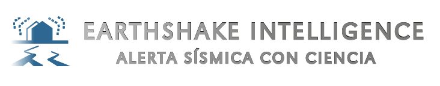
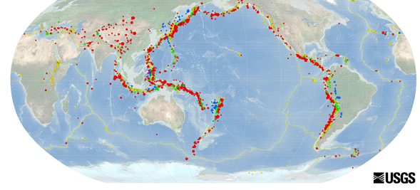

# README

> "Trabajando hacia la estandarización global de las redes sismológicas
> y la comunicación efectiva con la comunidad civil"

## Contexto

En este proyecto, ofrecemos una metodología para abordar una problemática específica relacionada con los sismos. Nuestro objetivo es proporcionar un entregable final que se adapte a las necesidades de las personas que se enfrentan a un sismo.

Para garantizar la calidad y confiabilidad de la información, hemos recurrido a fuentes confiables como la USGS. A partir de ahí, aplicamos una serie de conocimientos especializados en análisis de datos, ingeniería de datos y modelos de clasificación. Estos conocimientos nos permiten integrar la solución propuesta de manera eficiente.

El proceso comienza con la adquisición de datos, seguido de la transformación y carga de los mismos para su posterior consumo. Luego, utilizamos Power BI para realizar un análisis exhaustivo y definir un modelo de clasificación adecuado para el proyecto. Además, aprovechamos las ventajas de las herramientas en la nube para optimizar el rendimiento y la escalabilidad del proyecto.

En resumen, nuestro proyecto ofrece una metodología que aborda la problemática de los sismos, respaldada por información confiable y la aplicación de conocimientos especializados en análisis de datos, ingeniería de datos y modelos de clasificación. Aprovechamos las herramientas en la nube para brindar una solución eficiente y escalable.

## Alcance

En este proyecto, ampliamos el alcance de la recopilación de datos para incluir información relacionada con sismos en tres países: Chile, Japón y Estados Unidos. Estos países son reconocidos por su actividad sísmica significativa y proporcionan un conjunto de datos valioso para el análisis y la comprensión de la problemática.

Al incluir estos tres países, podremos obtener una perspectiva más amplia y diversa sobre los sismos, lo que nos permitirá desarrollar una metodología más completa y precisa. Utilizaremos fuentes confiables, como los organismos nacionales encargados de monitorear y registrar los sismos, para obtener la información necesaria.

El producto final de este proyecto incluye la entrega de una alerta por correo electrónico cada vez que ocurra un sismo con una magnitud establecida en cada uno de los países mencionados (Chile, Japón y Estados Unidos). Estas alertas contendrán la siguiente información:

1. País: Se proporcionará el nombre del país donde se ha registrado el sismo.
2. Región: Se indicará la región específica dentro del país donde se ha producido el sismo.
3. Magnitud: Se informará sobre la magnitud del sismo en la escala de Richter, que es una medida estandarizada para evaluar la energía liberada durante un sismo.
4. Clasificación: Se incluirá una clasificación del sismo en función de su magnitud, como leve, moderado, fuerte, etc. Esto ayudará a  proporcionar una idea general de la intensidad del evento sísmico.
5. Fecha y hora: Fecha y hora de ocurrencia del sismo.

## Objetivos generales

* Crear una base de datos depurada que contemple datos de Estados Unidos, Japón y Chile

* Implementar mecanismos de comunicación y alerta a la comunidad civil en un lenguaje intuitivamente interpretable a través de Internet

* Nuestro idea de producto mínimo viable (MVP) es diseñar un medio de contacto con la comunidad, ya sea una app o una página web, en principio posterior a un evento sísmico, para mitigar los efectos producidos del mismo.

## KPI'S

1. Tiempo de actualización: Diferencia entre la fecha y hora del evento sísmico y la fecha y hora de la alerta registrada y enviada a través de la página web o APP.
2. Alcance de alerta en Twitter (visualizaciones) : Después de realizar la publicación  Twitter se medirá la cantidad de visualizaciones y este valor se compara con el objetivo.
3. Usuarios registrados: Suscripción vía web/App, evaluación mensual de cantidad de usuarios registrados en la plataforma y se compara con el 50% de dicha población (USA, Chile y Japón).
4. Cantidad de usuarios registrados y ubicados en zonas seguras durante un evento sísmico.

## Medología

Para el desarrollo de este proyecto, se adoptaron metodologías ágiles para fomentar un ambiente colaborativo y maximizar la eficiencia en la entrega de resultados. Algunas de las metodologías ágiles utilizadas:

* Scrum: Se implementó el marco de trabajo Scrum, que divide el proyecto en sprints, con entregas incrementales y reuniones periódicas de planificación, revisión y retrospectiva. Esto permitió una gestión eficiente del proyecto y una mayor flexibilidad para adaptarse a los cambios y prioridades.

* Daily Stand-ups: Se realizaron reuniones diarias (daily stand-ups) para sincronizar al equipo, compartir actualizaciones, identificar bloqueos y ajustar el plan de trabajo en función de las necesidades y los avances.

* Retrospectivas: Se llevaron a cabo reuniones de retrospectiva al final de cada sprint o en intervalos regulares para analizar lo que funcionó bien, identificar áreas de mejora y planificar acciones correctivas.

## Documentos de interés

En los siguientes links puedes encontrar información detallada:

1. Análisis de metadatos.md [Análisis_metadatos](https://github.com/andesp19/Proyecto-Final-Data-Science/blob/f77f105d0345c3248a7274c669d5a2f4a7341ec2/1.%20An%C3%A1lisis%20de%20metadatos.md)

2. Stack Tecnológico Link: [Stack_tecnologico](https://github.com/andesp19/Proyecto-Final-Data-Science/blob/f77f105d0345c3248a7274c669d5a2f4a7341ec2/2.%20Stack%20Tecnol%C3%B3gico.md)

3. Propuesta de trabajo Link: [Propuesta_trabajo](https://github.com/andesp19/Proyecto-Final-Data-Science/blob/f77f105d0345c3248a7274c669d5a2f4a7341ec2/3.%20Propuesta%20de%20trabajo.md)

4. Proceso de ETL 

    * ETL detallado Link : [ETL](https://github.com/andesp19/Proyecto-Final-Data-Science/blob/f77f105d0345c3248a7274c669d5a2f4a7341ec2/4.%20ETL.ipynb)

    * Archivo .py utilizado: [ETL.py](https://github.com/andesp19/Proyecto-Final-Data-Science/blob/f77f105d0345c3248a7274c669d5a2f4a7341ec2/4.1.%20ETL.py)

5. Función lambda con API Gateway y S3 Link: [Lambda_Api_S3](https://github.com/andesp19/Proyecto-Final-Data-Science/blob/f77f105d0345c3248a7274c669d5a2f4a7341ec2/5.%20Documentaci%C3%B3n_DB.md)

6. AWS SES Amazon Simple Email Service [AWS_SES]()

7. Modelo de machine learning [Modelo_ML]()

## Pagina earthshake Intellingence 
En el siguiente link encontraras el sitio web de Earthshake Intelligence  https://sites.google.com/view/earthshake-intelligence/inicio?authuser=0

## Formularios
1. Registro link: https://docs.google.com/forms/d/e/1FAIpQLSeX45Wv97NEbgZtreAj-6VbuxhH_SJ7OGsNlBWHrUFxfBJBRg/viewform
2. Experiencia link: https://docs.google.com/forms/d/e/1FAIpQLSc-qZEx2xIEvzV4hwkDjcug2SZD71X4hxH-WZG2A6Tr-3yM7Q/viewform

## Diccionario

   Link [Diccionario](https://sites.google.com/view/earthshake-intelligence/inicio/diccionario-s%C3%ADsmico?authuser=0)

## Anillo de Fuego del pacifico

## Equipo de trabajo

* Andrés Espinosa: [LinkedIn](https://www.linkedin.com/in/andr%C3%A9s-espinosa-a8414a248/)
* José Gerchinhoren: [LinkedIn](https://www.linkedin.com/in/jos%C3%A9-gerchinhoren-102573249/)
* Alfred Mamani: [LinkedIn](https://www.linkedin.com/in/alfred-mamani-valdez-006501225)
* Agostina Balverde: [LinkedIn](https://www.linkedin.com/in/m-agostina-balverde-moll)

## Disclaimer  
De parte del equipo de Henry se quiere aclarar y remarcar que los fines de los proyectos propuestos son exclusivamente pedagógicos, con el objetivo de realizar proyectos que simulen un entorno laboral, en el cual se trabajen diversas temáticas ajustadas a la realidad.
 No reflejan necesariamente la filosofía y valores de la organización. Además, Henry no alienta ni tampoco recomienda a los alumnos y/o cualquier persona leyendo los repositorios (y entregas de proyectos) que tomen acciones en base a los datos que pudieran o no haber recabado. Toda la información expuesta y resultados obtenidos en los proyectos, nunca deben ser tomados en cuenta para la toma real de decisiones (especialmente en la temática de finanzas, salud, política, etc.).
